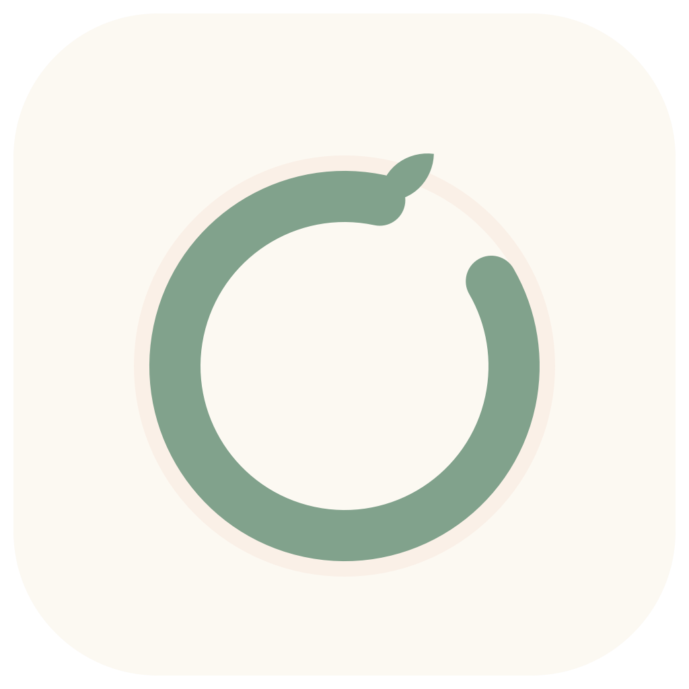
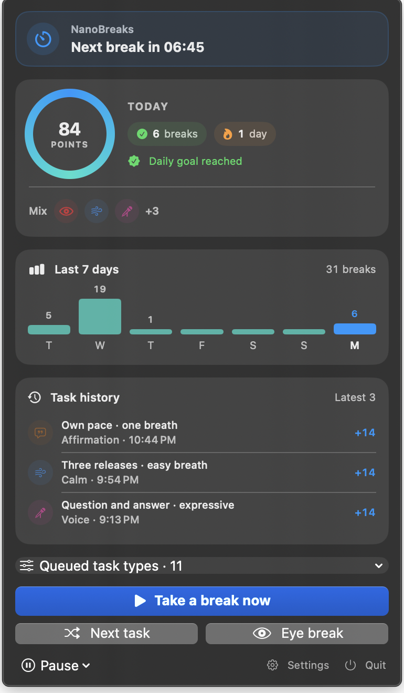

<p align="center">
  
</p>

<h1 align="center">NanoBreaks</h1>

<p align="center"><strong>small breaks for the mind, body, voice, and psyche</strong></p>

<p align="center">A private, native macOS menu-bar app for short, useful pauses that fit inside a real workday.</p>

## A better break should not become another project

NanoBreaks waits quietly in the menu bar, then offers one focused 20–60 second activity when it is time to step away from the screen. There is no account to create, nothing to track, and no feed asking for your attention.

The point is simple: do one small thing, return to what matters.

The default rhythm is one break every 20 minutes. A focused popup appears, counts down for five seconds, and starts itself. When the activity ends, complete it with one click or a keyboard shortcut and collect points immediately.

<p align="center">
  
</p>

<p align="center"><em>The menu-bar dashboard keeps the next break, private progress, task mix, and quick actions in one small place.</em></p>

## What you get

- **1,000 desk-friendly activities** across eyes, movement, mobility, calm, hydration, brain sparks, voice, writing, rhythm, mindfulness, and affirmations.
- **A fair task mix.** Balanced mode tracks what was actually shown, including swaps and skips, and keeps every enabled category at an effective 8% floor in normal rotation.
- **A useful escape hatch.** Swap any task, jump straight to an eye exercise, or generate the next task without leaving the keyboard.
- **Gentle motivation.** Immediate points, a daily goal, streaks, history, category variety, and a seven-day view. Enough feedback to make the habit visible, not enough to turn a break into a game.
- **A small app that respects the Mac.** Native SwiftUI, menu-bar first, no Dock clutter, universal Apple silicon and Intel build.

## A break for more than your eyes

NanoBreaks starts with eye relief, then goes wider. Some moments call for looking across the room. Others call for a wall pushup, a tiny writing prompt, a quiet hum, a rhythm pattern, or a believable reminder that the next small step is enough.

Writing activities use a real text field. Brain sparks have answers to reveal. Movement adapts to Seated-only, Quiet-office, or Standard mode. Every activity is short, practical, and designed to be easy to swap when the moment is wrong.

## Make it yours

In **Settings → Activities**, add a private prompt of your own: choose a category, name it, write the instruction, and set a 20–60 second duration. A custom activity receives the same category color, points, completion flow, swap controls, and fair rotation as the built-in catalogue.

Custom activities stay on the Mac. They are never sent anywhere, shared, or used to train anything.

## Keyboard-first by design

The task popup takes focus when it appears, so the useful controls work immediately.

| Shortcut | Action |
| --- | --- |
| `Control-S` | Swap the current task |
| `Control-E` | Show an eye exercise |
| `Control-N` | Show the next randomized task |
| `Control-D` | Complete the task once its timer ends |

You can also take a break now, pause for an hour or until tomorrow, hide an activity you never want to see again, and choose exactly which task categories are queued.

## Built around real working days

Choose a reminder interval from 10 to 120 minutes, active days and hours, a movement mode, task categories, a mix preset, popup colors, daily point goal, sound, and launch-at-login behavior.

When your Mac sleeps or locks, NanoBreaks pauses its clocks too. On return, the reminder resumes with the time that was left. Completing a scheduled or manual break starts a fresh full interval.

## Private by default

NanoBreaks works entirely on your Mac.

- No account, cloud sync, analytics, advertising, or network dependency.
- No camera, microphone, gaze tracking, screen recording, active-window monitoring, or keyboard monitoring.
- Settings and progress stay in `~/Library/Application Support/NanoBreaks/state.json`.

## Install

1. Download **NanoBreaks-1.0.0.dmg** from the [latest GitHub release](https://github.com/ajitcsn/NanoBreaks/releases/latest).
2. Drag **NanoBreaks** to **Applications**.
3. Launch it, choose your mix, and let the first reminder arrive.

For an upgrade from the original `20min` app, NanoBreaks copies existing progress automatically. Quit and remove the old app before launching the new one.

## A note on safety

NanoBreaks offers general break ideas, not medical care or a fitness program. Pick what is safe for you and your surroundings, and stop if something hurts or feels wrong. It does not make treatment, vision-improvement, fitness, or mental-health claims.

See [PRD.md](PRD.md) for the product boundaries, research notes, and detailed safety decisions.

## Develop locally

Requires macOS 14 or later and Swift 6.

```sh
swift build
swift run NanoBreaks
swift run NanoBreaksChecks
```

The executable checks cover the 1,000-task catalogue, task eligibility, the effective category distribution, task randomization, timer recovery after sleep, points, history, and saved-state compatibility.

## Build a release DMG

```sh
Scripts/package.sh
```

This creates a universal app, generates the icon, applies the Finder layout and volume artwork, ad-hoc signs the app and DMG, verifies both, and writes `dist/NanoBreaks-1.0.0.dmg`.

For a public release, use a Developer ID signing identity and notarize the result. The bundled local DMG is ad-hoc signed, so Gatekeeper may warn on another Mac.

```sh
NANOBREAKS_SIGN_IDENTITY="Developer ID Application: Your Name (TEAMID)" \
NANOBREAKS_NOTARY_PROFILE="NanoBreaks-notary" \
Scripts/package.sh
```

## Project layout

```text
Sources/NanoBreaksApp/     menu-bar UI, reminders, and app lifecycle
Sources/NanoBreaksCore/    activities, scheduling, selection, and scoring
Sources/NanoBreaksChecks/  executable behavior checks
Resources/Brand/           app icon and installer artwork
Scripts/                   packaging and Finder-layout automation
PRD.md                     product requirements and safety boundaries
```
